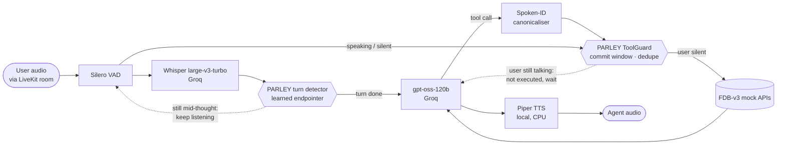

# PARLEY

**A LiveKit voice agent that listens through self-corrections before it acts.**

Samsung PRISM Y2026 GenAI Hackathon (3rd Edition) · **Theme 05 — Interruptible Real-Time Agents**
Team `ThaparPatiala_<TEAM>` · Thapar Institute of Engineering & Technology, Patiala

> *Parley (n.): a conversation between opposing parties, conducted under a truce, in which either
> side may speak at any moment.*

---

## The problem

People do not speak in finished commands. They say *"move my mortgage autopay to checking — wait,
no, savings"*, pause mid-sentence to find an order number, and spell IDs one character at a time.
A voice agent that calls a tool the moment it hears a plausible value acts on the abandoned one.
It then fires a second call for the correction, and for the benchmark and for the user that
extra call *is* the failure.

The scored benchmark, **Full-Duplex-Bench v3** (FDB-v3, [arXiv 2604.04847](https://arxiv.org/abs/2604.04847)),
measures exactly this on 100 real human recordings. Its authors find that self-correction is the
hardest category for every system they test, with even GPT-Realtime failing over 40% of them,
because agents *"commit intermediate parameters before the correction arrives"*.

PARLEY's answer is **cancel before effect**: hold a tool call until the user has actually
finished, and drop it if they were still talking.

## Architecture



The agent (`fdb/agent_parley.py`) is a fork of FDB-v3's stock `cascaded_agent.py`: the same 12
tools, tool schemas and logging, so the benchmark's runner and evaluators treat it exactly like
the stock agent. What PARLEY adds, all in `parley/fdb/`:

| Piece | What it does | Why |
|---|---|---|
| **Turn detector** (`turn.py`) | Our trained endpointer (`parley/agent/endpointer.py`) behind LiveKit's turn-detector interface. It keeps the turn open when the words so far end on a dangling word, a repair marker ("no", "I mean") or a trailing-off "…" | Ending the turn inside *"to checking — wait, no …"* hands the LLM the abandoned value |
| **ToolGuard** (`guard.py`) | Every call waits a 0.3 s commit window and runs only if the user is silent *and* nothing they said is still being transcribed. Otherwise the LLM gets *"not executed, the user is still speaking"*. An identical `(tool, args)` runs at most once per conversation | Cancel before effect. It is the only defence once the LLM has already fired |
| **Spoken-ID canonicaliser** (`args.py`) | `P-5-2` → `P52`, but only in ID arguments whose pieces are all ≤ 3 characters | Whisper inserts separators nobody said, and the LLM copies them |
| **Local TTS** (`local_tts.py`) | Piper speaks in-process on CPU | Groq's free TTS allows 100 requests a day, far short of 100 clips |
| **Instructions** | Act only on the final corrected value. Only perform state-changing actions the user asked for. Never claim an action whose tool did not succeed | Each rule addresses a failure seen in our transcripts |

Each conversation gets a fresh `ToolGuard`; nothing is cached across scenarios.

## Run it

**Requirements:** Linux or macOS, Python **3.10 or 3.11**, `ffmpeg`, `git`, `curl`, internet.
A GPU is used by FDB-v3's own ASR scorer if present. The agent itself needs none.

**Keys** — put them in the environment. `reproduce.sh` writes them to FDB-v3's
`v3/.env.local`, which is gitignored:

| Variable | Needed for | Where to get it |
|---|---|---|
| `LIVEKIT_URL`, `LIVEKIT_API_KEY`, `LIVEKIT_API_SECRET` | the LiveKit room the benchmark streams into | a free LiveKit Cloud project → Settings → Keys |
| `GROQ_API_KEY` | STT and LLM | console.groq.com → API Keys (free tier; see the quota warning below) |
| `OPENAI_API_KEY` *(optional)* | FDB-v3's gpt-4o judge and latency analyser | platform.openai.com. **Without it, scoring is exact-match only and there is no latency report** |

**One command:**

```bash
bash reproduce.sh                      # all 100 recordings
SAMPLES=5 bash reproduce.sh            # the first 5 (development)
SAMPLES=10 SAMPLE_OFFSET=5 SAMPLE_STEP=10 bash reproduce.sh   # 10 spread over all 4 domains
RESUME=1 RUN_DIR=runs/fdb/<run> bash reproduce.sh              # continue a run, keep finished clips
```

It creates `.venv-fdb`, installs the pinned `requirements-fdb.txt`, and clones FDB-v3 at a
pinned commit into `third_party/`. It then downloads the benchmark data and the checksummed Piper
voice, starts the agent, streams every clip through LiveKit, and runs FDB-v3's evaluators.
Everything lands in `runs/fdb/<timestamp>-parley/`: the three reports, `config.txt` (versions,
commits, settings), the agent's tool-call log, the guard's suppressions, a per-room transcript
and LiveKit per-stage metrics. `python scripts/fdb_summary.py <run dir> <results dir>` prints the
per-clip table.

Settings (all optional): `PARLEY_TURN_DETECTOR=0` / `PARLEY_GUARD=0` (ablation),
`PARLEY_LLM` (Groq model id), `PARLEY_REASONING` (gpt-oss effort, default `low`),
`PARLEY_TTS=groq` (Orpheus instead of Piper), `PARLEY_BACKEND=openai` (the stock agent's exact
OpenAI models, for a like-for-like baseline), and `PARLEY_LLM_BASE_URL` (+ `PARLEY_LLM_API_KEY`,
`PARLEY_LLM`) to send LLM calls to any OpenAI-compatible server instead of Groq. On a GPU, for
example: `vllm serve openai/gpt-oss-20b`, then
`PARLEY_LLM_BASE_URL=http://localhost:8000/v1 bash reproduce.sh`. That removes the daily token
cap below. STT still uses Groq; its free tier allows about 8 hours of audio a day.

> **Quota warning.** Groq's free tier caps each tool-calling model at **200,000 tokens per day**.
> A clip costs about 4,000, so **a full 100-clip run needs about two days of free quota**. Either
> use `RESUME=1` across two days or serve the LLM yourself with `PARLEY_LLM_BASE_URL` (above).
> See [`docs/STATUS.md`](docs/STATUS.md).

## Models and services

| Role | Model / software | Licence | Where it runs |
|---|---|---|---|
| Speech-to-text | Whisper large-v3-turbo (OpenAI) | MIT | Groq API |
| LLM, tool calling | gpt-oss-120b (OpenAI), `reasoning_effort=low` | Apache-2.0 | Groq API |
| Text-to-speech | Piper 1.2.0 + `en_US-ljspeech-medium` voice (LJ Speech dataset) | MIT / public domain | local CPU |
| Voice activity | Silero VAD via `livekit-plugins-silero` 1.3.12 | MIT | local CPU |
| Turn detection | PARLEY endpointer (logistic regression on our own synthetic corpus) | ours | local CPU |
| Agent framework | LiveKit Agents 1.3.12 | Apache-2.0 | local |
| Benchmark | FDB-v3 @ `3e799c45`, its NeMo parakeet-tdt-0.6b-v2 ASR scorer and optional gpt-4o judge | per FDB-v3 | local / OpenAI |

No calls to servers of our own at evaluation time.

## Results

Every run, with what changed and why, is in [`docs/FDB_RESULTS.md`](docs/FDB_RESULTS.md).
Read the caveats first:

- **Exact-match scoring only.** We have no OpenAI key, so FDB-v3's gpt-4o judge did not run.
  Argument and response accuracy are therefore stricter than in the paper, and response quality
  is unscored.
- **Measured in a cloud sandbox with no GPU and no route to LiveKit Cloud media.** We ran a local
  `livekit-server`, and FDB-v3's ASR scorer ran on CPU through local-only shims that are not in
  this repo. Latency is from that machine.
- **Small samples.** The same clip has flipped between pass and fail on replays. With 5–10
  clips, one clip is noise.
- **No 100-clip run yet.** The free tier's daily token cap stopped us (above).

| Clips | Configuration | Strict pass | Tool selection | Mean latency |
|---|---|---|---|---|
| first 5 (ecommerce) | submitted agent, Orpheus TTS | 4/5 | 93.3% | 10.1 s |
| first 5 | + local Piper TTS | 4/5 | 93.3% | **5.7 s** |
| first 5 | **ablation**: turn detector and guard off | 5/5 | 100% | 5.0 s |
| 10 spread, all domains | before the step-4 fixes (mixed run) | 3/10 | 91.9% | 6.1 s |
| 10 spread | + guard/turn/retry fixes | **4/10** | 81.1% | 6.8 s |
| 10 spread | same config, **gpt-oss-20b** (A/B baseline) | **6/10** | 100% | 6.3 s |
| 10 spread | gpt-oss-20b + guard waits for untranscribed speech (kept) | 5/10 † | 100% | 5.6 s |

† One clip was lost to FDB-v3's own client crashing at teardown; on the other nine, pass/fail
is identical to the baseline. The gpt-oss-20b rows exist because gpt-oss-120b's free daily
token cap was spent. They compare changes against each other, and were tested on these 10
clips only. The submitted default is still gpt-oss-120b.

**What the ablation says, honestly:** on the 5 easy clips our additions show no benefit. The
one-clip difference is replay noise, and the guard's commit window costs latency. Those clips
contain no self-corrections. On the spread set, the self-correction clip is where the guard
visibly works: *"switch my mortgage autopay … from the checking — wait, no … make it savings"*
went from two calls (checking, then savings) to one call on savings. For reference, the paper's
stock cascaded agent scores 0.45 Pass@1 on all 100 clips *with* the gpt-4o judge, a different
and more lenient measure.

## Extension (20% use case): camera device troubleshooting

> **This is the extension use case, not part of the FDB-v3 benchmark agent.** It is a separate
> LiveKit agent (`fdb/agent_extension.py`) so its extra tool can never draw calls on the benchmark.

**What it does.** You talk to it and point your camera at a washing machine panel, a router or a TV.
It subscribes to your video track, keeps only the latest frame in memory, and has one tool,
`diagnose_device_frame()`, which runs PARLEY's perception code on that frame
(`parley.multimodal.ground_frame`: colour classifier + OCR of the panel + abstention). Then one of
three things happens:

| Tool status | What the agent does |
|---|---|
| `diagnosed` | names the fault (e.g. *panel reads E4*) and reads out the matching manual steps |
| `ask` | two faults are too close to call: it asks which one (*"is it the WAN LED amber or the power LED red?"*) and names no diagnosis until you answer |
| `retake` / `no_frame` | it asks you to move the camera closer / square-on, or to turn the camera on |

The same frame is never diagnosed twice (the ported idempotency ledger, `parley.fdb.ToolGuard`), and
all state is per session: nothing is cached across sessions. The logic lives in
`parley/extension/camera.py` and is tested offline in `tests/test_extension.py` (no network).

**Run it.** Same free Groq backend as the benchmark agent (Whisper-large-v3-turbo STT,
`openai/gpt-oss-120b`). Extension-only models: Groq's Orpheus TTS (`canopylabs/orpheus-v1-english`,
falling back to local Piper) and RapidOCR (`rapidocr-onnxruntime`, Apache-2.0, local CPU) for panel
text. Put `LIVEKIT_URL`, `LIVEKIT_API_KEY`, `LIVEKIT_API_SECRET` and `GROQ_API_KEY` in `.env.local`
at the repo root (gitignored), then:

```bash
pip install -e ".[vision]" piper-tts==1.2.0 python-dotenv==1.2.3     # no NeMo needed
pip install "livekit-agents[openai]==1.3.12" livekit-plugins-groq==1.3.12 livekit-plugins-silero==1.3.12
python fdb/agent_extension.py dev      # terminal 1: the agent worker
python fdb/agent_extension.py token    # terminal 2: prints URL + a token that dispatches the agent
```

Open [meet.livekit.io/?tab=custom](https://meet.livekit.io/?tab=custom), paste the URL and token,
click Connect, then Join Room with camera and microphone on. (The Agents Playground now requires
signing in to the LiveKit Cloud account that owns the project, so a token is the simpler route.)
The agent registers under the explicit name `parley-extension`, so it only joins rooms whose token
asks for it. To see what it sees, start it with `PARLEY_EXT_DEBUG_DIR=<dir>`: each diagnosed frame
is saved there with its result (off by default).

**What it does not do.**

- It knows four device states: `washer_error_e4`, `router_power_led_red`, `router_wan_led_amber`,
  `tv_hdmi_no_signal`. Anything else is an abstention (`retake`) or, for an unknown panel code, a
  question naming the code. It does not identify appliance models or read arbitrary text.
- The classifier was trained on **synthetic** frames only (see HANDOFF.md §7). How it does on real
  phone photos is measured, not assumed:

  **Real-camera results** (9 frames captured by the live agent from a phone camera on 30 Sep, held
  out from all training):

  | Frames | Result |
  |---|---|
  | Real Samsung TV "No Signal" screens, blue and light grey (5) | **5 diagnosed correctly**, from the words on screen (`screen reads 'no signal'`); the colour model alone abstained on all 5 |
  | Real TV "No Cable Connected" screen (1) | abstained (retake): a different message, deliberately not claimed |
  | Our synthetic washer / router images filmed off a laptop screen (3) | abstained (retake) |
  | **Wrong diagnoses** | **0** |

  We also tried retraining the colour classifier on camera-style augmented renders (blur, tilt,
  exposure, colour cast, bloom, compression). It was rejected: clean accuracy dropped to ~0.89, it
  began answering the "two LEDs lit" frames it must ask about, and real-frame results were
  unstable (3/9 then 1/9 correct over two augmentation settings). The shipped colour model is
  unchanged; the gains above come from reading the screen. Caveat: the "No Signal" rule was added after
  seeing these frames, so they are not an independent test of it. First independent check: a live
  test on a different TV showing "No Signal" was diagnosed correctly (observed by the tester; the
  frame was not saved). More real photos are needed, especially of routers and washers.
- **Groq free-tier TTS is tiny:** Orpheus allows about 3,600 characters and 100 requests per day
  per account, and a few minutes of conversation can use it up.
  When Groq returns 429 the agent switches to the benchmark agent's **offline Piper voice**
  (`parley/fdb/local_tts.py`; `reproduce.sh` downloads and checksums it into `models/piper/`) and
  switches back when Groq recovers, so the voice changes mid-conversation instead of the session
  ending. Without the voice file it runs on Groq alone.
- Remedies come from the bundled manual pages (`harness/mockenv/world.py`), not from a real
  manufacturer database, and the LLM is instructed not to add steps of its own.

## Repository map

| Path | What |
|---|---|
| `fdb/agent_parley.py` | the scored LiveKit agent |
| `parley/fdb/` | turn detector, ToolGuard, ID canonicaliser, Piper TTS |
| `fdb/agent_extension.py`, `parley/extension/` | the extension: camera device troubleshooting agent (not scored on FDB-v3) |
| `reproduce.sh`, `requirements-fdb.txt` | one-command, pinned reproduction |
| `scripts/fdb_summary.py` | per-clip table and latency breakdown for a run |
| `docs/FDB_RESULTS.md` | every benchmark run and what changed |
| `docs/KERNEL.md` | the original PARLEY kernel and the harness it was built on (now our internal regression net) |
| `docs/RESEARCH.md`, `docs/PRIOR_ART.md` | prior art and what we took from it, with credits |
| `DISCLOSURE.md`, `docs/AI_PROMPT_LOG.md` | AI usage disclosure and prompts |

`python -m pytest` runs the whole suite. The `tests/test_asr.py` failures without the optional
`voice` extra (Vosk) are expected.
